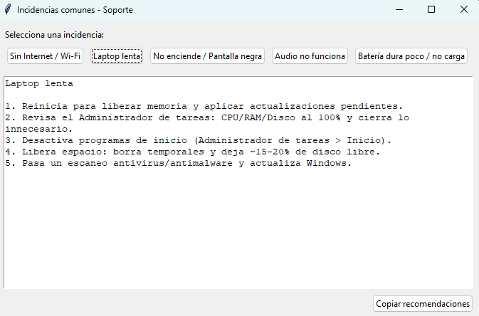

# Proyecto Incidencias - Asistente de Soporte Técnico

Este proyecto es una herramienta de escritorio desarrollada en Python con **Tkinter** diseñada para ayudar al personal de soporte técnico o usuarios finales a diagnosticar y solucionar problemas comunes de hardware y software en laptops.

Proporciona una lista rápida de pasos de verificación para las incidencias más frecuentes, permitiendo copiar las recomendaciones fácilmente para enviarlas por chat o correo.

## 📋 Características

La aplicación cubre las siguientes categorías de incidencias:
*   📶 **Sin Internet / Wi-Fi**: Soluciones de conectividad.
*   🐢 **Laptop lenta**: Optimización y limpieza básica.
*   ⚫ **No enciende / Pantalla negra**: Pasos de diagnóstico de energía y hardware.
*   🔊 **Audio no funciona**: Verificación de sonido y drivers.
*   🔋 **Batería dura poco / no carga**: Diagnóstico de energía y cargador.

## 🚀 Requisitos

*   **Python 3.x** instalado.
*   Librería **Tkinter** (generalmente incluida con la instalación estándar de Python).

## 🔧 Instalación y Ejecución

1.  Clona este repositorio:
    ```bash
    git clone https://github.com/alxz0212/proyecto_incidencias.git
    ```
2.  Navega a la carpeta del proyecto:
    ```bash
    cd proyecto_incidencias
    ```
3.  Ejecuta la aplicación:
    ```bash
    python app_incidencias.py
    ```

## 📖 Manual de Uso

La interfaz es intuitiva y consta de tres pasos simples:

1.  **Seleccionar Incidencia**: En la parte superior, haz clic en el botón correspondiente al problema reportado (ej. "Sin Internet / Wi-Fi").
2.  **Visualizar Pasos**: Las recomendaciones y pasos de solución aparecerán automáticamente en el área de texto central.
3.  **Copiar al Portapapeles**: Haz clic en el botón **"Copiar recomendaciones"** en la parte inferior para copiar el texto y pegarlo donde lo necesites (ticket de soporte, chat, email).

### 📸 Captura de Pantalla



---
Desarrollado por [alxz0212](https://github.com/alxz0212)
