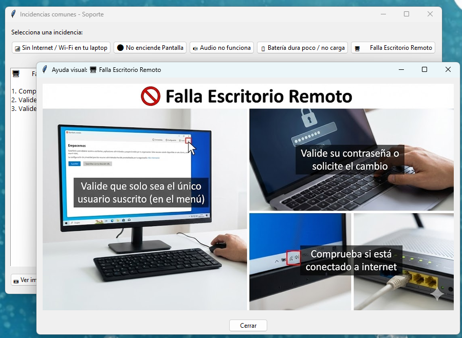

# Proyecto Incidencias - Asistente de Soporte Técnico

Este proyecto es una herramienta de escritorio desarrollada en Python con **Tkinter** diseñada para ayudar al personal de soporte técnico o usuarios finales a diagnosticar y solucionar problemas comunes de hardware y software en laptops y PCs.

Proporciona una lista rápida de pasos de verificación para las incidencias más frecuentes, permitiendo copiar las recomendaciones fácilmente para enviarlas por chat o correo.

## 📋 Características

La aplicación cubre las siguientes categorías de incidencias:
*   📶 **Sin Internet / Wi-Fi**: Soluciones de conectividad.
*   ⚫ **No enciende / Pantalla negra**: Diagnóstico diferenciado para **Laptop** y **PC de Escritorio**.
*   🔊 **Audio no funciona**: Verificación de sonido y drivers.
*   🔋 **Batería dura poco / no carga**: Diagnóstico de energía y cargador.
*   🖥️ **Falla Escritorio Remoto**: Verificación de conexión y credenciales.

*(Nota: La opción "Laptop lenta" está actualmente desactivada pero disponible en el código).*

### Funcionalidades Extra
*   **Ayuda Visual**: Cada incidencia incluye un botón **"📷 Ver imagen de ayuda"** que muestra diagramas o fotos de referencia.
*   **Soporte de Imágenes**: Compatible con formatos JPG, PNG y WebP gracias a la librería `Pillow`.
*   **Navegación**: Botón "Atrás" para navegar fácilmente entre subopciones.

## 🚀 Requisitos

*   **Python 3.x** instalado.
*   Librería **Tkinter** (incluida en Python).
*   Librería **Pillow** (para manejo de imágenes).

## 🔧 Instalación y Ejecución

1.  Clona este repositorio:
    ```bash
    git clone https://github.com/alxz0212/proyecto_incidencias.git
    ```
2.  Navega a la carpeta del proyecto:
    ```bash
    cd proyecto_incidencias
    ```
3.  **Instala la dependencia de imágenes:**
    ```bash
    pip install Pillow
    ```
4.  Ejecuta la aplicación:
    ```bash
    python app_incidencias.py
    ```

## 📖 Manual de Uso

La interfaz es intuitiva y consta de tres pasos simples:

1.  **Seleccionar Incidencia**: En la parte superior, haz clic en el botón correspondiente al problema reportado.
    *   *Si seleccionas "No enciende", elige si es Laptop o PC.*
2.  **Visualizar Pasos**: Las recomendaciones aparecerán en el área de texto central.
3.  **Ver Imagen**: Si necesitas ayuda visual, haz clic en el botón de la cámara 📷 abajo a la izquierda.
4.  **Copiar al Portapapeles**: Haz clic en el botón **"Copiar recomendaciones"** para llevar el texto a tu chat o ticket.

### 📸 Captura de Pantalla



---
Desarrollado por [alxz0212](https://github.com/alxz0212)
